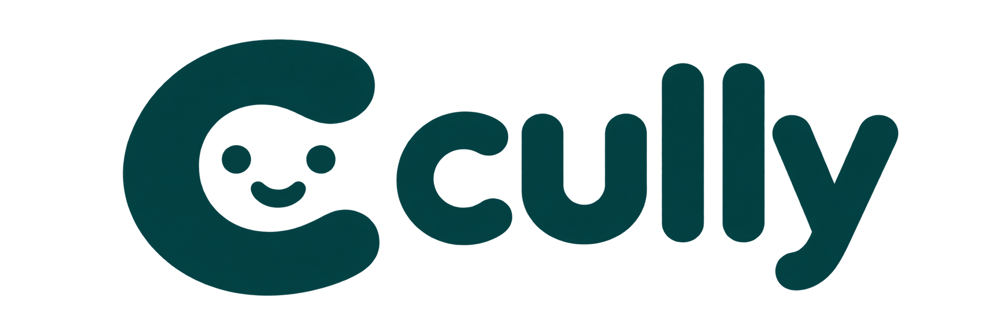

<p align="center">
  
</p>

# Cully

**Your companion for better work and everyday life.**

[Website](https://cully.net) · [Docs](https://docs.cully.net) (planned hosting)

Cully remembers what you do and how you work. It helps you guide coding agents, manage projects, and spot ways to improve your workflow. When you ask it to remember personal things, it can help with your goals, routines and everyday life too.

| Component | What it does |
| --- | --- |
| `cully` | Local advisor, agent setup, session status and suggestions |
| `cully-mcp` | OAuth-protected shared memory tools |
| `cully-data` | Private PostgreSQL/pgvector API and self-hosted Mem0 indexing |

Works with Claude Code, Codex and Cursor. It combines Agent Flightdeck and Buddy in one Go repository, preserving both histories. PostgreSQL stores the original records; self-hosted Mem0 adds semantic recall.

## Get started

From this checkout, with Go 1.25 or newer:

```sh
go build -o ./build/cully ./cmd/cully
./build/cully install
./build/cully status
./build/cully mcp add --agent codex
```

Configure shared memory separately using the [installation guide](docs/installation.md). The future deployment target is the existing Buddy VM; repository changes do not activate the new service endpoint.

## Documentation

- [Install and connect agents](docs/installation.md)
- [Session controls](docs/flightdeck/README.md)
- [Shared memory and tools](docs/memory.md)
- [Architecture](docs/architecture.md)
- [Configuration](docs/configuration.md)
- [Self-hosted Mem0](docs/mem0.md)
- [Hosted and self-hosted setup](docs/hosting.md)
- [VM migration](docs/migration.md)
- [Website, docs and DNS](docs/website.md)
- [Development and tests](docs/development.md)
- [Roadmap](docs/roadmap.md)
- [Source history and release archive](docs/archive/flightdeck/README.md)

Licensed under [Apache 2.0](LICENSE).
