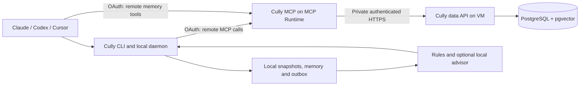

# Cully: combination architecture and Go migration plan

Prepared 2026-10-06. Status: repository transfer/consolidation and initial Go service port implemented on the integration branch. Deployment remains a future operation; later optimization and automatic session-sync phases remain planned.

## Accepted deployment and memory decisions

- The user chose self-hosted Mem0, reached through a Go HTTP adapter.
- The future deployment target is the VM currently running Buddy. Preserve its database and data volume.
- Cully's CLI, MCP and data services are Go. Upstream Mem0 remains a separately hosted dependency.
- PostgreSQL is the source of truth. A transactional outbox drives Mem0 projection, and semantic recall validates live owner-scoped source records.
- Initial Mem0 projection uses infer=false, not automatic fact extraction. Automatic session-to-remote sync and the deeper Flightdeck package split remain follow-ups.

## Product decision

Cully is a companion for coding agents: it observes the current session, suggests useful controls, and remembers substantive work across agents and devices. Personal memory remains a first-class feature alongside project work.

One repository: `mcp-runtime/cully`. One Go module: `github.com/mcp-runtime/cully`. Three small executable entry points, independent release artifacts, shared domain logic. No Python production services, old command aliases, old MCP tool aliases, or legacy environment-variable support.

Do not equate Go with an automatic latency improvement. Go should reduce service startup and packaging overhead and support bounded concurrency well. Database plans, network hops, transcript scanning, and advisor model calls still determine much of the latency. Measure these independently.

## Source review

Inspected repository trees, READMEs, Flightdeck memory, daemon, worker, analyzer and integration code, and Buddy MCP handlers, settings, OAuth verification, data API and PostgreSQL repository.

- Flightdeck baseline: `90d4ff4fc8cd45df31b6d6597ff1a85a96212498`.
- Buddy baseline: `10c88e0913d407565d3b1a52b3087e4083c9d3b9`.
- File reads used main; revalidate against these SHAs when implementation begins because main can move.
- Flightdeck: https://github.com/mcp-runtime/agent-flightdeck
- Buddy: https://github.com/mcp-runtime/buddy

Buddy already names Flightdeck integration as a deferred direction. This plan brings that integration forward while retaining personal memory and the existing isolated database deployment.

## Feature combination

| Existing capability | Source | Cully treatment |
| --- | --- | --- |
| Branch, PR, model, effort, context, tokens, cache, rate and cost instruments | Flightdeck | Preserve local instruments; normalize per agent and session |
| Rich Claude status line and Stop/SessionEnd hooks | Flightdeck | Preserve supported client behavior; hooks enqueue work and return promptly |
| Native Codex status fields, saved command and project guidance | Flightdeck | Preserve through a dedicated adapter; verify client support before release |
| Cursor command, skills and MCP discovery | Flightdeck | Preserve through a dedicated adapter; use explicit capability reporting |
| Skills, agents, MCP, graphify and plugin awareness | Flightdeck | Cached capability inventory keyed by project and agent |
| Context/budget/workflow suggestions, severity, phases, checklists | Flightdeck | Rules first; optional model advisor enriches results |
| Tool-gap scouting | Flightdeck | Optional bounded background task; no install from generated advice alone |
| Numbered apply, dry run, instruction/config propagation | Flightdeck | Retain explicit apply; stable suggestion IDs, previewable changes and managed markers |
| Plan, deferred status, debrief and daemon controls | Flightdeck | Retain CLI commands; persist accepted actions and useful debriefs |
| Hourly compact session capture and local search | Flightdeck | Incremental adapters, durable local memory, optional authenticated upload |
| Log/search/recent/get/update/delete/projects | Buddy | Port all seven operations to Go with Cully names |
| Personal/company sections and personal categories | Buddy | Preserve; company section is a label, not shared team authorization |
| Summary, approach, outcome, issue, learning, next steps, tags | Buddy | Preserve typed structured records; avoid fabricated fields in automatic capture |
| GitHub URL normalization and agent identity | Buddy | Shared domain validation used by MCP, HTTP and CLI ingestion |
| OAuth subject isolation | Buddy | Preserve; principal is trusted identity derived from verified token |
| PostgreSQL full-text and optional 1536-dimensional vectors | Buddy | Preserve FTS default; optimize hybrid search; no mandatory embedding provider |
| Explicit timestamp offsets and IST responses | Buddy | Preserve validation and output policy; configurable display zone later |
| Private VM data API plus Runtime-hosted MCP | Buddy | Port both services to Go; retain current separation |
| Compose, Caddy, container deployment, real MCP/database E2E | Buddy | Rework for Go binaries and Cully routes; preserve production integration coverage |

## Runtime architecture



Executables:

- `cully`: user CLI, agent hooks, cached status rendering, local daemon and OAuth client.
- `cully-mcp`: public MCP transport and OAuth resource boundary; no database credentials in the Runtime deployment.
- `cully-data`: private HTTP API and PostgreSQL access on the VM; also owns explicit database migration commands.

Keep this as a modular application, not many independently networked feature services. No Redis, message broker, remote model service or separate embedding service is required for v1.

Provide an optional single-host deployment profile: the MCP handlers call the same memory service with a PostgreSQL repository directly. This removes one network hop when both are deliberately deployed together. The normal Runtime deployment continues to use the private HTTP repository adapter.

The remote MCP server only accesses shared memory. Local agent configuration and apply operations remain on the user's machine. They do not become remotely callable mutation tools.

## Repository structure

```text
cully/
  go.mod
  go.sum
  cmd/
    cully/main.go
    cully-mcp/main.go
    cully-data/main.go
  internal/
    app/                 # composition and lifecycle, minimal mains
    config/              # typed configuration and CULLY_* settings
    identity/            # principal, OAuth resource verification, JWKS cache
    memory/              # models, validation, service, repository interfaces
    session/             # normalized session events, summaries and cursors
    advisor/             # rules, severity, phases, optional model provider
    capability/          # cached skills/agents/MCP/tool discovery
    action/              # suggestion identity, previews, explicit application
    daemon/              # local scheduling, bounded workers and shutdown
    sync/                # OAuth-backed upload, retry and idempotency
    agents/
      claude/
      codex/
      cursor/
    store/
      postgres/          # SQL and pgx pool
      local/             # snapshots, compact memory, cursors and outbox
      remote/            # service-authenticated HTTP repository adapter
    transport/
      cli/
      mcp/
      datahttp/
    observability/       # slog and metrics without memory contents
  migrations/            # ordered, versioned SQL
  skills/cully/SKILL.md
  assets/                # embedded commands, prompts and checklists
  deploy/
    compose.yaml
    caddy/
    runtime/             # MCPServer manifest and configuration
  scripts/
    install.sh
  tests/
    integration/
    e2e/
    fixtures/            # synthetic/sanitized per-agent transcripts
  benchmarks/
  docs/
    architecture.md
    installation.md
    deployment.md
    migration.md
    adr/
  .github/workflows/
  .goreleaser.yaml
```

Dependency rule: transports call application/domain services; services depend on narrow interfaces; stores and client adapters implement them. MCP and HTTP handlers must not each implement their own validation. PostgreSQL and agent-specific formats do not leak into domain types. Use `internal/` until there is a real external Go API consumer; do not add speculative public packages.

## Go service port

| Python component | Go destination | Implementation requirement |
| --- | --- | --- |
| `settings.py` | `internal/config` | Validate required settings at startup; resolve public OAuth resource explicitly |
| `auth.py` | `internal/identity` | RS256 allowlist, issuer/audience/expiry/subject checks; bounded JWKS refresh and rotation handling |
| `validation.py` | `internal/memory` | Typed validators, URL canonicalization, text/tag limits, finite vectors and explicit timestamp offsets |
| `time_utils.py` | `internal/memory` | `time.Time` instants, RFC3339 input, Asia/Kolkata formatting; embed zone data if minimal image needs it |
| `server.py` | `internal/transport/mcp` | Official Go MCP SDK, typed tool input/output, Streamable HTTP, resource metadata |
| `repository.py` | `internal/store/remote` | Shared HTTP transport, connection reuse, timeouts, bounded body sizes, typed errors |
| `data_api.py` | `internal/transport/datahttp` | `net/http`, strict typed requests, shared validation, private service authentication |
| `postgres_repository.py` | `internal/store/postgres` | `pgx/v5` pool, parameterized SQL, owner predicates, query deadlines |
| `buddy_service.py` | `cmd/cully-mcp` | Replace with Go entry point; remove Python entry point |

Use the official [MCP Go SDK](https://github.com/modelcontextprotocol/go-sdk), [pgx](https://github.com/jackc/pgx), and PostgreSQL with [pgvector](https://github.com/pgvector/pgvector). Pin supported versions after the transport/auth integration spike; do not depend on floating main branches.

Prefer standard `net/http`, `encoding/json`, `context`, `slog`, and `testing` where sufficient. Select a maintained JWT verifier with required claim checks and JWKS support during the identity spike. Do not write cryptographic token verification from scratch.

Core operation methods: Create, Search, Recent, Get, Update, Delete and Projects. Each takes a trusted principal and typed input. Optional update fields must distinguish omitted values from explicit clearing. Do not reproduce arbitrary `map[string]any` SQL updates.

MCP tools: `cully_log`, `cully_search`, `cully_recent`, `cully_get`, `cully_update`, `cully_delete`, `cully_projects`.

Initially retain Buddy's semantics and limits, with documented corrections where needed. Examples: validate section/category filters at every boundary, reject non-finite embeddings, and avoid fetching large vectors for recent/get results that do not return them.

## Identity and deployment contract

Treat the configured issuer and verified subject as the account identity. Map to an internal owner ID, avoiding collisions if multiple issuers are supported later. Never trust a public caller-supplied owner field. The private service may accept forwarded identity only after authenticating the MCP service.

Register `https://mcp.mcpruntime.org/cully/mcp` as the new OAuth resource. Serve protected-resource metadata and appropriate authentication challenges through the public route. Test audience validation using the configured public resource even when the proxy rewrites Host internally.

Buddy currently treats a missing scope as `tools:read`, and uses that scope for mutation tools too. For Cully, define and enforce read/write permissions explicitly and configure the issuer to grant them. Choose the exact scope names with the auth server integration; test every supported client instead of silently accepting absent scopes.

Suggested configuration groups: `CULLY_DATA_API_URL`, `CULLY_DATA_API_TOKEN`, `CULLY_DATABASE_URL`, `CULLY_AUTH_ISSUER`, `CULLY_AUTH_RESOURCE`, `CULLY_HOST`, `CULLY_PORT`, `CULLY_MEMORY_INTERVAL`, `CULLY_ADVISOR_PROVIDER`, `CULLY_SYNC_ENABLED`. Document Runtime-provided platform variables separately if required by its contract; those are not old-product aliases.

Production profile: Postgres stays on the private Compose network; Caddy exposes only the intended data API route to authorized service traffic. The local CLI uses public OAuth MCP, never the private service token. OAuth login uses the issuer's supported authorization-code/PKCE flow; refresh tokens belong in the OS credential store.

## Unified memory and sync

Separate transient telemetry from durable memory. Context pressure and tool counters update local snapshots. Substantive work, blockers, decisions, lessons and debriefs become memory records. Do not upload every instrument tick.

1. Agent adapters parse native transcript formats into a normalized event stream. Use real sanitized fixtures; current generic string extraction is not an adequate cross-agent parser contract.
2. Track file identity and byte offset, plus partial-record state. Handle rotation, truncation, multiline formats and format version changes explicitly.
3. Produce compact summaries at session end or a checkpoint. Record source agent, device, session, project URL and event range as provenance. Automatic capture does not invent approach/outcome/learning.
4. Store summaries locally before enqueueing upload. Use atomically written per-item outbox files, restrictive permissions and one daemon lock for v1; introduce a local database only if scale warrants it.
5. Bind every outbox item to its account and destination resource. On logout/account change, pause that account's queue; never send old items using a new identity.
6. Sync through authenticated MCP calls with a persisted idempotency key and payload hash. Server enforces uniqueness per owner/key; same key with conflicting content is rejected. Acknowledge locally only after confirmed server commit.
7. Retry transient failures with exponential backoff and jitter; refresh expired tokens; quarantine invalid records; cap spool size and show pending/error counts. No indefinite silent data loss.
8. Add optimistic record versions for updates and deletion tombstones, so delayed retries cannot recreate deliberately deleted memory. Define retention and manual reimport semantics explicitly.

Keep manual memory and captured session activity distinct with an origin field. Default automatic capture to company/project work when a project mapping exists. Personal notes remain intentional; an unmapped working directory must not cause fabricated GitHub URLs or guessed section assignment. Offer local-only capture until remote upload is enabled.

Suggested schema: `cully_entries` retains current Buddy fields and adds origin, provenance, record version, optional source key and content hash. Add owner-scoped uniqueness for source keys. Put session identity/event range in typed columns where queried; bounded metadata can carry auxiliary provenance. Do not store raw transcripts remotely by default.

Local paths: config under the platform config directory, durable data under its data directory, expendable snapshots under cache. Namespace all locations as `cully`, independently of Claude's config directory.

## Performance work with evidence

| Path | Current observation | Proposed change | Validation |
| --- | --- | --- | --- |
| Status rendering | Local instrument and snapshot composition | Render cached state; no remote calls or model invocation | Warm/cold wall time, p95 and allocations |
| Session capture | Modified files reread up to a 1 MiB tail; state uses mtime seconds and size | Incremental per-format cursors, startup/recovery scan, periodic reconciliation | Large transcript bytes read, missed/duplicate records, CPU |
| Advisor queue | File polling, serial worker, queued path points to mutable signals | Immutable snapshot per job, per-session coalescing, bounded concurrency and cancellation | Bursts across projects; no cross-session mixups |
| Daemon shutdown | Cancellation followed by fixed sleep | Wait groups, deadlines and durable queue recovery | Interrupted jobs and restart behavior |
| Advisor cost | Claude-specific model process plus optional search | Fast rules first, explicit provider interface, cooldowns and bounded model tasks | Provider unavailable, model latency and spend |
| Recent/project queries | Owner/project index exists; other indexes less owner-focused | Add justified owner/time and owner/section/time indexes | EXPLAIN ANALYZE on representative distributions |
| Vector/text search | Mixed score expression and OR predicate | Separate bounded FTS and nearest-vector candidates, then rank fusion | Retrieval quality, latency and actual index plans |
| Vectors with filters | HNSW index plus owner/project filters | Measure recall under selective filters; use supported iterative scans or exact search for small scopes | Multi-owner recall tests; no cross-owner candidate leaks |
| HTTP/database | Separate VM call and Postgres pool | Persistent transports, bounded pool and request/query deadlines | Throughput, pool wait, timeout/error behavior |
| JWT verification | Cached JWK set | Bounded cached keys, controlled unknown-key refresh | Warm auth latency and key-rotation tests |

Do not assume the existing embedding query uses HNSW efficiently: nearest-neighbor candidate retrieval needs an index-friendly distance ORDER BY/LIMIT form. Do not rank together uncalibrated FTS and cosine values by blindly adding them. Use reciprocal-rank fusion over candidate lists as the initial hybrid design and test with a retrieval fixture set.

All candidate retrieval must be owner-scoped. Query limits, batch sizes, queue limits and concurrency are explicit. Caches include principal identity whenever their data is owner-specific. Do not cache mutable remote search results in v1 without a coherent invalidation design.

Initial engineering targets, not measured claims: warm cached status rendering p95 <= 50 ms on a declared developer machine; hook enqueue p95 <= 100 ms; CRUD/FTS p95 <= 150 ms and hybrid search <= 300 ms on a declared service/database fixture, excluding external network and model latency. Establish Python and Flightdeck baselines first, publish hardware/dataset/concurrency, and revise targets based on measurements.

## Implementation sequence and completion gates

### 1. Repository consolidation and baseline

Transfer Flightdeck to the org; retain Buddy as the destination and rename it Cully. Import Flightdeck on an integration branch with unsquashed history, preferably a subtree under `cli/` as a temporary landing area. Then move its Go source into the final module layout. Preserve source licenses and copyright notices; verify Buddy's license before publishing combined releases. Git history import does not move issues, releases or GitHub settings: inventory these separately. Prefix/archive colliding old release tags rather than confusing Cully version tags.

Gate: both parent histories are reachable, CI baseline captured, features and known gaps recorded, no production route changes yet.

### 2. Domain and PostgreSQL port

Implement shared types, validation, identity handling, all seven operations, explicit migrations and the pgx repository. Preserve current stored records, IDs and timestamps. Add structured provenance, idempotency, tombstones/versioning and justified indexes.

Gate: database integration tests cover owner isolation, personal/company behavior, updates/clearing, timezone offsets, FTS, vectors, limits and concurrent duplicate uploads.

### 3. Go data API and MCP

Implement private typed HTTP API and official SDK MCP handlers. Add OAuth verification and metadata, public-resource proxy handling, scopes, health/readiness and graceful shutdown. Keep migration execution out of normal request-serving startup. Use the same memory service in direct and split deployment profiles.

Gate: real client -> MCP -> data API -> pgvector end-to-end tests pass, including invalid tokens, wrong issuer/audience, missing permissions, two owners, expiry and JWKS rotation.

### 4. Flightdeck refactor and Cully CLI

Split the existing cockpit package by behavior incrementally; preserve instruments and rules rather than rewrite proven logic. Rename commands, install markers, embedded prompts, skills, paths and environment variables to Cully. Create cached status rendering, immutable advisor jobs and clean daemon lifecycle. Agent adapters report capabilities instead of assuming all agents expose the same hooks.

Gate: fixtures verify all supported agent integrations; install/uninstall preserves user-owned settings; action dry runs match the actual edits; offline status/advising works.

### 5. Cross-agent memory and sync

Implement per-agent incremental capture, local outbox, CLI OAuth login, public MCP upload, idempotent server ingestion and account-bound recovery. Give the advisor a small project-scoped memory context, retrieved asynchronously with a timeout; memory unavailability must not stall instruments.

Gate: interrupted writes, daemon restarts, server outage, expired tokens, repeated delivery, account switches, transcript rotation and deletion/retry scenarios are verified.

### 6. Optimization, release and cutover

Run benchmarks and query-plan analysis, tune only measured hot paths, build signed/checksummed platform binaries and two server images, and publish one coherent Cully release. Use a fresh Cully version sequence independent of both products' old tags.

Back up the database and validate restore first. Pause old ingestion, perform transactional/versioned migration into Cully tables, compare row counts and checksums, deploy Go data and MCP services, register the new OAuth resource, and update clients/installers. Keep a deployment rollback path to the pre-cutover image and backup; this is operational recovery, not maintained compatibility. Explicitly reinstall agent integrations and remove only recognized old managed blocks/files. Archive Flightdeck after the new release is verified.

Gate: no Python runtime dependency, old product command/tool/env names absent from active interfaces, original memory intact, supported clients connected, metrics within agreed budgets and recovery tested.

## Verification and release policy

- Unit tests for domain invariants, rules, timestamp handling and parsers; no redundant tests that only restate trivial wiring.
- `go test ./... -race` and `go vet ./...`; fuzz transcript parsing and strict request decoding where useful.
- Real pgvector integration tests and MCP authentication E2E; structured service errors distinguish invalid input, unauthenticated, forbidden, not found, conflict and retryable failure.
- Logs contain operation IDs, durations, queue depth, pool wait and error categories. Exclude note content, prompts, tokens and raw SQL parameters.
- Benchmarks cover status rendering, incremental capture, advisor scheduling, startup/RSS, CRUD and search under representative owner/project distributions.
- Release independent CLI/MCP/data artifacts from one tag. Build server-only binaries without bundling local advisor providers or agent installation assets.
- Ship installation, deployment, new OAuth/client configuration, database cutover and uninstall documentation with the release.

## Scope boundaries

V1 does not require a web dashboard, team-wide memory authorization, autonomous config changes, a central model server, embedding generation, or a local vector database. Personal/company labels continue to describe an authenticated owner's records. True organization-shared memory needs a separate membership and authorization design.

The critical implementation path is domain/database -> Go services/auth -> CLI refactor -> durable sync -> measured optimization -> cutover. Feature parity and data correctness precede throughput tuning.
