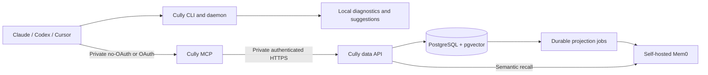

# Architecture

Cully has one Go module and three executable entry points. Domain validation is shared across the memory transports; PostgreSQL and HTTP adapters implement the same repository interface.



## Local session companion

`cmd/cully` uses the imported session-control implementation in `internal/cully`. It renders instruments, discovers capabilities, runs advisory analysis, manages suggestions and records diagnostic session counters. Claude has the rich command-backed status line and hooks. Codex and Cursor use their available native integrations.

The local advisor works offline. It does not run a background transcript scanner or maintain a second personal/project memory store. Local snapshots and diagnostic logs support session controls; agents use the Cully MCP tools for durable memory. Automatic session upload is not implemented.

## Public memory boundary

`cmd/cully-mcp` exposes tools through the official Go MCP SDK and Streamable HTTP. By default it serves one configured owner without OAuth, intended for loopback or a trusted private network. It does not contact an identity provider in that mode. With `--oauth` or `CULLY_MCP_AUTH_MODE=oauth`, `internal/identity` verifies the configured issuer, public resource audience, RS256 signature, expiration and subject. Each tool checks read or write permission.

In OAuth mode, the verified subject becomes the owner. In no-OAuth mode, `CULLY_MCP_OWNER` is the fixed owner. Public tool inputs cannot choose a different owner. OAuth resource metadata is published only in OAuth mode and advertises the configured public resource rather than relying on a proxy-rewritten Host header.

`internal/store/remote` calls the private Go data API with a service token. Database and Mem0 credentials stay on the VM.

## Private memory service

`cmd/cully-data` hosts the private API, runs the Mem0 worker, and provides explicit `migrate`, `reindex` and `health` commands. `internal/memory` owns types and input validation. `internal/store/postgres` implements owner-scoped SQL using a bounded pgx pool.

Full-text search uses PostgreSQL's generated search vector. Optional 1536-dimensional query vectors retrieve nearest candidates with pgvector. Hybrid search combines bounded text and vector candidate lists through reciprocal-rank fusion.

## Semantic memory

PostgreSQL is authoritative. When Mem0 is enabled, source edits and projection jobs commit in the same transaction. Self-hosted Mem0 does the semantic indexing and candidate recall work. A worker reconciles one owner's source entry into Mem0 and retries outages with backoff. Deletes remove the corresponding projection.

`cully_recall` uses Mem0 to find candidates, then loads live records from PostgreSQL. It rejects another owner's records, deleted entries and projections with outdated source timestamps. It returns source records, not unverified raw Mem0 results.

Projection uses `infer=false`: Mem0 embeds authored summaries without adding a fact-extraction model call. Its upstream runtime remains a separate dependency; Cully's own binaries are Go.

## Delivery boundaries

The product website and technical docs have separate images, Compose services, path-filtered CI workflows and rollback state. A change under `site/` deploys `cully-web`; a change under `docs/` deploys `cully-docs`. Caddy routes their domains to separate containers on the existing workspace network. See [website hosting](website.md).

The personal MCP and data services follow the release pipeline. A successful GoReleaser job publishes a tagged data image, then the gated [personal deployment workflow](personal-deployment.md) updates the VM data service before the MCP Runtime workload. PostgreSQL and Mem0 are operated separately; the release controller cannot create or replace them.

## Repository map

```text
cmd/                 CLI, MCP and data entry points
internal/cully/      local session controls and agent integration
internal/memory/     shared memory types and validation
internal/identity/   OAuth verification
internal/mem0/       self-hosted REST adapter
internal/store/      PostgreSQL and remote HTTP adapters
internal/transport/  MCP and private HTTP handlers
internal/app/        server lifecycle and composition
internal/config/     typed configuration
migrations/          explicit, versioned SQL
skills/cully/        combined session and memory guidance
deploy/              site and personal-service deployment files
docs/                guides and roadmap
```

The intended cutover uses the VM currently running Buddy for PostgreSQL, the Cully data API and self-hosted Mem0. The public MCP service can continue in MCP Runtime. See [the VM runbook](migration.md) for preserving the existing volume and switching clients.
