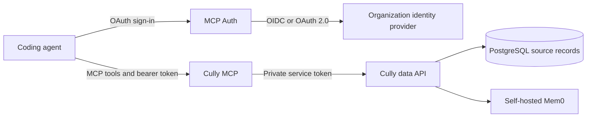

# Team deployment with OAuth

This example shows how a team can use Cully with its organization's existing identity provider. Cully's MCP endpoint is the OAuth-protected resource. [MCP Auth](https://github.com/mcp-runtime/mcp-auth) is the authorization server between the coding agent and the identity provider; it handles the MCP OAuth flow and delegates sign-in to the provider. The identity provider continues to manage users and access. Cully uses the verified token subject as the record owner, so each person sees their own records.



## Set up the services

1. Choose public HTTPS names for the MCP endpoint and authorization server, such as `mcp.example.com` and `auth.example.com`. The MCP resource URL is `https://mcp.example.com/mcp`.
2. Follow the [MCP Auth identity-provider connector guide](https://github.com/mcp-runtime/mcp-auth/blob/main/docs/auth-server.md#oidc-or-plain-oauth-20) for the OIDC or OAuth 2.0 provider your organization uses, including its identity claims and upstream endpoints. Register the [MCP Auth callback URL](https://github.com/mcp-runtime/mcp-auth/blob/main/docs/auth-server.md#the-redirect-uri-you-register-with-your-identity-provider) with that provider. Keep its client secret private. MCP Auth uses this connector to complete the MCP OAuth flow.
3. In a Cully checkout, set `CULLY_MCP_HOST`, `CULLY_AUTH_HOST` and `MCP_AUTH_UPSTREAM_CLIENT_SECRET` in `deploy/self-hosted/.env`. Prepare the connector JSON and MCP Auth signing key as shown in [MCP OAuth](/oauth#self-hosted-docker-with-mcp-auth). Then start the Docker stack from `deploy/self-hosted`:

   ```sh
   ./setup.sh --oauth mcp-auth
   ```

   Setup derives the resource URL, issuer and JWKS URL from the two hostnames. It generates the database passwords and private service tokens and starts PostgreSQL, Mem0, the data API, Cully MCP, MCP Auth and Caddy. The data API, Mem0 and databases stay on private Docker networks.
4. Give each team member the MCP URL. They install the Cully skill and register the endpoint in one command, then sign in from their agent:

   ```sh
   curl -fsSL https://cully.net/install.sh | sh -s -- --agent codex --mcp-url https://mcp.example.com/mcp --oauth
   ```

   Use `claude` or `cursor` instead of `codex` as needed. An agent does not receive the database password, Mem0 key or MCP-to-data API token.

## Authorization boundaries

| Connection | How it is authorized |
| --- | --- |
| Agent → Cully MCP | MCP Auth issues a token for the exact MCP resource URL. Cully checks its signature, issuer, audience, subject and tool scope. Reads require `tools:read`; writes require `tools:write`. |
| Cully MCP → data API | A private Cully service token, independent of the agent's OAuth token. |
| Data API → PostgreSQL and Mem0 | Separate private database and Mem0 credentials. |

The Cully maintainer also deploys a personal MCP endpoint on [MCP Runtime](https://mcpruntime.org), a platform for publishing MCP servers. That platform operates MCP Auth and passes the configured issuer and resource URL to Cully. You can use MCP Runtime or operate MCP Auth and Cully yourself; [MCP Runtime's publishing guide](https://docs.mcpruntime.org/publish-mcp-server/) explains its platform path. The identity-provider connector is configured on the authorization server, while the Cully MCP resource declares its own `tools:read` and `tools:write` scopes.
