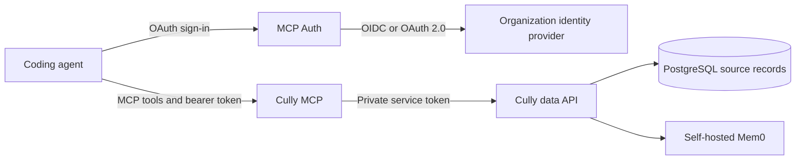

# Use Cully with a team

A team can run Cully with its organization's identity provider so each person signs in and accesses their own records. The coding agent connects to Cully's public MCP endpoint. [MCP Auth](https://github.com/mcp-runtime/mcp-auth) can act as the MCP authorization server and connect upstream to the organization's OIDC or OAuth 2.0 provider. Its MCP-facing flow follows the MCP OAuth 2.1 profile. Cully checks the issued token and uses its subject as the record owner.



## Choose where the services run

Your ops team can use Docker Compose, Docker, Kubernetes or another container platform. The [Compose stack](/hosting) is the quickest way to run all services on one machine. Starting with v0.3.0, Cully releases publish matching `ghcr.io/mcp-runtime/cully-mcp`, `ghcr.io/mcp-runtime/cully-data` and `ghcr.io/mcp-runtime/cully-mem0` images under the release tag. Deploy those images using your normal registry and tooling. The services take environment variables and private network endpoints; they do not require Compose at runtime.

Run the PostgreSQL schema migration with the data image's `migrate` command before serving traffic. Keep the data API, Mem0 REST endpoint and PostgreSQL databases private. Mem0 needs its own pgvector-enabled PostgreSQL database and the persistent history volume shown in the [Compose reference](https://github.com/mcp-runtime/cully/blob/main/deploy/self-hosted/compose.yaml). Put HTTPS in front of the public MCP endpoint. Your authorization server can run beside Cully or elsewhere.

| Service | Essential settings |
| --- | --- |
| Cully MCP | `CULLY_DATA_API_URL`, shared `CULLY_DATA_API_TOKEN`, `CULLY_MCP_AUTH_MODE=oauth`, `CULLY_AUTH_ISSUER`, exact public `CULLY_AUTH_RESOURCE`, `CULLY_JWKS_URL` |
| Data API | `CULLY_DATABASE_URL`, same `CULLY_DATA_API_TOKEN`, `CULLY_MEM0_URL` and `CULLY_MEM0_API_KEY` when Mem0 is enabled |
| Mem0 | Its own PostgreSQL settings, `ADMIN_API_KEY` matching `CULLY_MEM0_API_KEY`, `JWT_SECRET`, persistent history volume |

See the [configuration reference](/configuration) for all variables and [architecture](/architecture) for the service flow. Service tokens and database credentials are independent of agent OAuth and belong in the operator's secret store, never in an agent's configuration.

## Connect your identity provider

1. Choose an HTTPS MCP URL, for example `https://mcp.example.com/mcp`, and an authorization-server URL. Configure the authorization server to issue tokens for that exact MCP resource with `tools:read` and `tools:write` scopes.
2. Follow the [MCP Auth identity-provider guide](https://github.com/mcp-runtime/mcp-auth/blob/main/docs/auth-server.md#connect-an-organizations-identity-provider) to configure the connector, client credentials, identity claims and callback with your organization's provider. MCP Auth supports OIDC and OAuth 2.0 connectors; the provider continues to manage users and sign-in.
3. Configure Cully MCP with the issuer, resource URL and JWKS endpoint supplied by the authorization server. The values must agree with the token it issues. The [MCP OAuth guide](/oauth) shows the Compose path with MCP Auth.
4. Give each team member the public MCP URL. They can install the Cully skill and register the endpoint with one command:

   ```sh
   curl -fsSL https://cully.net/install.sh | sh -s -- --agent codex --mcp-url https://mcp.example.com/mcp --oauth
   ```

   Use `claude` or `cursor` instead of `codex` as needed. The agent then completes sign-in. It never receives database passwords, Mem0 keys or the MCP-to-data service token.

## Quick path with Docker Compose

After installing the Cully CLI, run `cully setup --prepare`. Edit `~/.cully/self-hosted/config/.env` with the public MCP and authorization hostnames and your upstream client secret. Set up `connectors.json` and the MCP Auth signing key in the same config directory as described in [MCP OAuth](/oauth#self-hosted-docker-with-mcp-auth). Then start the stack:

```sh
cully setup --oauth
```

This starts PostgreSQL, Mem0, the data API, Cully MCP, MCP Auth and Caddy. Each team member connects their own agent to the public MCP URL.

The Cully maintainer uses [MCP Runtime's publishing guide](https://docs.mcpruntime.org/publish-mcp-server/) to deploy a personal Cully MCP endpoint. MCP Runtime runs MCP Auth and passes Cully its OAuth issuer and resource URL; the Cully [server manifest](https://github.com/mcp-runtime/cully/blob/main/.mcp/servers.yaml) declares `tools:read` and `tools:write` for that resource.

<div class="related-product">
  <p class="related-product__eyebrow">Another product from the Cully maintainer</p>
  <h3>MCP Runtime</h3>
  <p>An open source Kubernetes platform for building, deploying and operating MCP servers. It gives servers HTTPS routes, access controls and audit records. The maintainer uses it to run Cully's MCP endpoint, with MCP Auth connected to an identity provider for OAuth. Cully's PostgreSQL, data API and Mem0 run separately.</p>
  <div class="related-product__links">
    <a href="https://mcpruntime.org">Explore MCP Runtime ↗</a>
    <a href="https://docs.mcpruntime.org/publish-mcp-server/">Read the deployment guide ↗</a>
  </div>
  <p class="related-product__contact">The MCP Runtime maintainer is looking for the product's first customer. If your team needs a platform for MCP servers, <a href="mailto:princekrroshan01@gmail.com?subject=MCP%20Runtime%20for%20our%20team">contact him</a>.</p>
</div>
